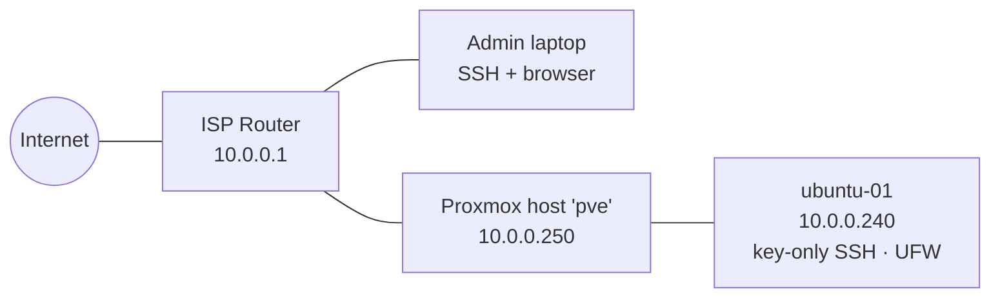

# HomeLab

A self-built Proxmox homelab I use as hands-on training for **CompTIA A+, Network+, Linux+, Security+** and **AWS** — and as the foundation for real services at home (media, DNS filtering, remote access, IoT).

Every project is documented as a **camp**: goal, build steps, verification, troubleshooting log, and lessons learned.

---

## Hardware

| Device | Role | Specs |
|---|---|---|
| Dell OptiPlex 5050 SFF | Proxmox VE host | Intel i5-6500 (4C, VT-x/VT-d), 16 GB DDR4 |
| ↳ 256 GB Samsung NVMe | Host OS + VM disks (`local-lvm`) | Fast tier |
| ↳ 1 TB Toshiba HDD | ISOs, backups, templates (`hdd-storage`) | Capacity tier, S.M.A.R.T. verified |
| Cisco managed switch | VLAN lab (future camp) | Held until segmentation phase |

## Network

| Host | IP | Purpose |
|---|---|---|
| Router / gateway | `10.0.0.1` | ISP gateway, DHCP |
| `pve` | `10.0.0.250` (static) | Proxmox host, web UI on `:8006` |
| `ubuntu-01` (VM 100) | `10.0.0.240` (static) | Hardened Linux server |
| Reserved for VMs/containers | `10.0.0.240–.249` | |

**Security posture:** no ports forwarded, no DMZ. Everything is LAN-only until remote access is added through Tailscale (zero open ports).

---

## Camps

| # | Camp | Status | Key skills | Write-up |
|---|---|---|---|---|
| 1 | Proxmox foundation | ✅ Done | BIOS/UEFI, hypervisor install, static IP, apt repos, tiered storage, S.M.A.R.T. | [camp-1-proxmox.md](camp-1-proxmox.md) |
| 2A | First Linux VM | ✅ Done | VM sizing, Ubuntu Server install, SSH, LVM online resize, guest agent, snapshots | [camp-2-session-a.md](camp-2-session-a.md) |
| 2B/C | Static IP + hardening | ✅ Done | netplan, ed25519 keys, password/root login disabled, UFW default-deny, auto-patching | [camp-2-sessions-b-c.md](camp-2-sessions-b-c.md) |
| 3 | Tailscale remote access | ⏳ Next | VPN/overlay networking, zero-trust access | — |
| 4 | Jellyfin media server | Planned | LXC containers, iGPU passthrough, storage | — |
| 5 | AdGuard Home | Planned | DNS, network-wide filtering, rollback planning | — |
| 6 | Home Assistant | Planned | IoT integration | — |
| 7 | Backups + Immich | Planned | Backup strategy, self-hosted photos | — |
| 8 | Docker host | Planned | Containers, app hosting | — |
| 9 | Cisco switch + VLANs | Planned | Segmentation, 802.1Q, inter-VLAN firewalling | — |
| 10 | AWS hybrid | Planned | Cloud + on-prem integration | — |

---

## Highlights

- **Verify before acting:** SHA-256 checksums on every ISO; caught a wrong-architecture (ARM64) download before flashing.
- **Change safely:** snapshots before risky changes; `netplan try` auto-rollback for network changes; `sshd -t` config test before restarting SSH.
- **Troubleshoot, don't reinstall:** resolved an antivirus driver blocking USB writes, a fast-boot menu issue, a mis-selected repository, and an SSH auth failure, each isolated layer by layer.
- **Least privilege:** normal user + `sudo`, key-only SSH, no root login, default-deny firewall.

## Lessons Learned

- Read the config before you edit it. Filenames and defaults aren't always what you expect.
- A passing test can pass for the wrong reason (e.g., `ping` succeeding over IPv6, not IPv4). Check *which path* it took.
- Always check the prompt: `PS C:\` is the laptop, `mike@ubuntu-01` is the server.
- Change → verify. "I updated it" means nothing until the output proves it.

---

*Built alongside a B.S. in Cloud & Network Engineering (AWS track) at WGU.*
